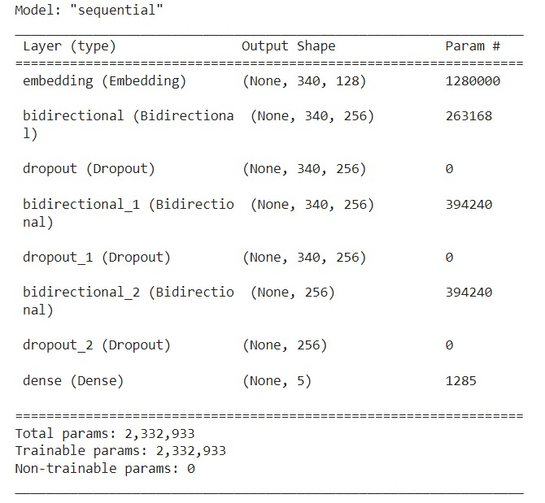
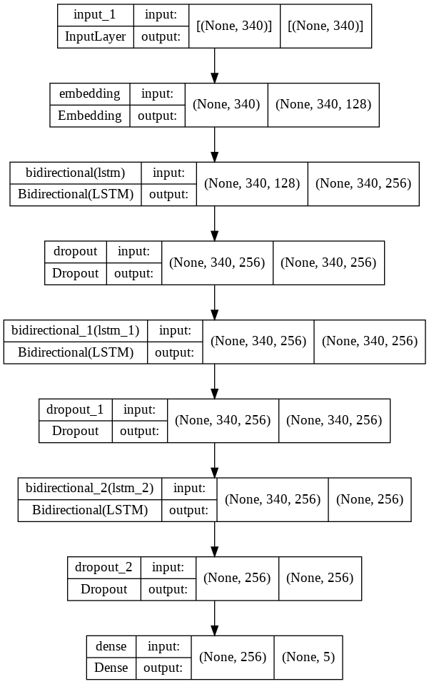
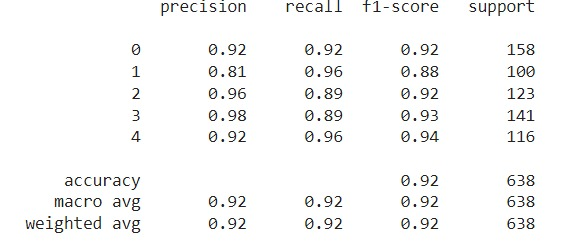

# Articles-Categorization-Analysis-Project
<p align="justify"> Sentiment analysis (or opinion mining) is a natural language processing (NLP) technique used to determine whether data is positive, negative or neutral. Sentiment analysis is often performed on textual data to help businesses monitor brand and product sentiment in customer feedback, and understand customer needs.</p>

## Project Descriptions 
<p align="justify"> Text documents are essential as they are one of the richest sources of data for businesses. Text documents often contain crucial information which might shape the market trends or influence the investment flows. Therefore, companies often hire analysts to monitor the trend via articles posted online, tweets on social media platforms such as Twitter or articles from newspaper. However, some companies may wish to only focus on articles related to technologies and politics. Thus, filtering of the articles into different categories is required.

Here, our aim is <b> to categorize unseen articles into 5 categories </b> namely Sport, Tech, Business, Entertainment and Politics. </p> 

## Project Organization
  ```
  ├── Datasets                                    : Contains file about the project
  ├── Save_models                                 : Contains model saved from Article_categorization_Analysis.py (.pkl/.json/.h5 format)
  ├── Statics                                     : Contains all save image (graphs/heatmap/tensorboard)
  ├── .gitattributes                              : .gitattributes
  ├── Article_categorization_Analysis.py          : Code file in python format
  ├── GitHub_url.txt                              : Github url in .txt
  └──  README.md                                  : Project Descriptions 
  ```
# Methadology
  - **Step 1 - Loading the data:**
     - <p align="justify"> Data preparation is the primary step for any deep learning problem. The dataset can be obtained from this link 
     [dataset](https://raw.githubusercontent.com/susanli2016/PyCon-Canada-2019-NLP-Tutorial/master/bbc-text.csv). 
     This dataset consists of a texts that will be use for training. </p>

           CSV_URL = 'https://raw.githubusercontent.com/susanli2016/PyCon-Canada-\
           2019-NLP-Tutorial/master/bbc-text.csv'
           
           df = pd.read_csv(CSV_URL)


  - **Step 2) Data Inspection:**

           df.head()
           df.tail()
           
           # can check duplicated in NLP
           # There is 99 duplicated text
           df.duplicated().sum()
           
  - **Step 3) Data Cleaning:**

           # Remove the duplicated data
           df = df.drop_duplicates() 
           
           # Assign variable to the dataset columns
           article = df['text'].values  # features of X
           category = df['category'].values # target, y

           # To backup the dataset
           article_backup = article.copy()
           category_backup = category.copy()
           
   - **Step 4) Features Selection**
     - no features selection were made

   - **Step 5) Data Preprocessing** 
     - 1) Convert into lower case. 
          - No upper case been detected in text. So, we may skip this process.

     - 2) Tokenizing
          - Here, we would like to change the text into numbers and the process to learn all the words is been done here.

                 # must not contain empty list
                 # need to convert the text to numbers
                 vocab_size = 10000 
                 oov_token = '<OOV>'

                 tokenizer = Tokenizer(num_words=vocab_size,oov_token=oov_token)
                 tokenizer.fit_on_texts(article) # Learning all the words
                 word_index = tokenizer.word_index

                 # To show 10 to 20 only put the slice after the list
                 print(dict(list(word_index.items())[10:20]))

                 # to convert into numbers
                 article_int = tokenizer.texts_to_sequences(article)

                 # to check length of every sentence in review
                 for i in range(len(article_int)):
                   print(len(article_int[i]))
               
     - 3) Padding & truncating

               # to decide the length of the padding, use median to pick the padding number
               length_article = []
               for i in range(len(article_int)):
                 length_article.append(len(article_int[i]))
                 #print(len(article_int[i]))
               
               # to get the number of max length for padding
               np.median(length_article)

               # comprehension
               max_len = np.median([len(article_int[i])for i in range(len(article_int))])
               max_len # need to convert to integer

               padded_article = pad_sequences(article_int,
                                             maxlen=int(max_len),
                                             padding='post',
                                             truncating='post')


     - 4) One Hot Encoding for the target

                 ohe = OneHotEncoder(sparse=False)
                 category = ohe.fit_transform(np.expand_dims(category,axis=-1))

     - 5) Train test split

               X_train,X_test,y_train,y_test = train_test_split(padded_article, 
                                                    category,
                                                    test_size=0.3,
                                                    random_state=123)


   - **Model Development**
       - <p align="justify"> By using the model Sequential, LSTM, dropout, Bidirectional, Embedding and Dense, Our model development is been structured.</p>
       
                input_shape = np.shape(X_train)[1:]
                out_dim = 128

                model = Sequential()
                model.add(Input(shape=(input_shape)))
                model.add(Embedding(vocab_size,out_dim)) 
                model.add(Bidirectional(LSTM(128,return_sequences=True)))
                model.add(Dropout(0.3))
                model.add(Bidirectional(LSTM(128,return_sequences=True)))
                model.add(Dropout(0.3))
                model.add(Bidirectional(LSTM(128)))
                model.add(Dropout(0.3))
                model.add(Dense(5,activation='softmax'))

                model.summary()

                model.compile(optimizer='adam',loss='categorical_crossentropy',
                              metrics=['acc'])
                     
        - <p align="justify"> The model summary is shown below.</p>
        
        
        
   - **Model Training**
       - <p align="justify"> This model include tensorboard callbacks, ModelCheckpoint, and EarlyStopping to reduce overfitting when training the model. This model only used 5 epoch to train.</p>
       
                # Tensorboard Callbacks
                tensorboard_callback = TensorBoard(log_dir=LOGS_PATH,histogram_freq=1)

                # ModelCheckpoint
                mdc = ModelCheckpoint(BEST_MODEL_PATH,monitor='val_acc',
                                      save_best_only=True,
                                      modes='max',verbose=1)
                # EarlyStopping
                early_callback = EarlyStopping(monitor='val_loss',patience=3)

                hist = model.fit(X_train,y_train,
                                epochs=5,
                                validation_data=(X_test,y_test),
                                callbacks=[mdc,tensorboard_callback,early_callback])
                                
       - <p align="justify"> The visualization of our model architecture can be presented in the figure below: </p>
       

   - **Model Evaluation**
      - <p align="justify"> Through this section, classification report and confusion matrix is been used as a part of our model evaluation and analysis. Around 92% accuracy have been achieved. </p>

                y_pred = np.argmax(model.predict(X_test),axis=1)
                y_actual = np.argmax(y_test,axis=1)
                cm = confusion_matrix(y_actual,y_pred)
                cr = classification_report(y_actual,y_pred)

                print(cm)
                print(cr)

                disp = ConfusionMatrixDisplay(confusion_matrix=cm)
                disp.plot(cmap=plt.cm.Blues)
                plt.show()
      
      - <p align="justify"> The classification report is shown below. </p>
      
      
      - <p align="justify"> The confusion_matrix is shown below. </p>
      

# Results and Discussion :pencil:
  - **Plotting the graph**
      - <p align="justify"> Although there is a sign of overfitting towards the end of the training, the early stopping have prevent the overfiting to happen.</p>
      
      
      


# Credits :open_file_folder:

This project is made possible by the data provided from this
[susanli2016](https://raw.githubusercontent.com/susanli2016/PyCon-Canada-2019-NLP-Tutorial/master/bbc-text.csv)

